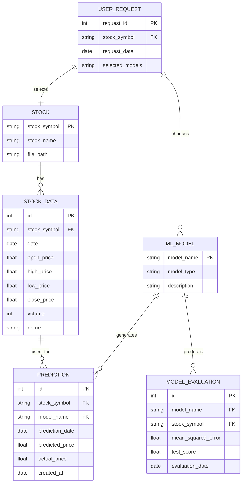

# Stock Price Prediction Project - ER Diagram

## Entity-Relationship Diagram

## Project Structure Overview

### Entities Description:

1. **STOCK**: Represents individual stock companies
   - Attributes: stock_symbol (Primary Key), stock_name, file_path
   - Example: AAPL, GOOGL, MSFT

2. **STOCK_DATA**: Historical stock price data from CSV files
   - Attributes: id (Primary Key), stock_symbol (Foreign Key), date, open_price, high_price, low_price, close_price, volume, name
   - Relationship: Many-to-One with STOCK

3. **ML_MODEL**: Machine Learning models available for prediction
   - Attributes: model_name (Primary Key), model_type, description
   - Models: SVR_linear, SVR_rbf, SVR_poly, linear_regression, random_forests, KNN, DT, elastic_net, LSTM_model

4. **PREDICTION**: Stock price predictions generated by ML models
   - Attributes: id (Primary Key), stock_symbol (Foreign Key), model_name (Foreign Key), prediction_date, predicted_price, actual_price, created_at
   - Relationships: Many-to-One with STOCK_DATA and ML_MODEL

5. **MODEL_EVALUATION**: Performance metrics for ML models
   - Attributes: id (Primary Key), model_name (Foreign Key), stock_symbol (Foreign Key), mean_squared_error, test_score, evaluation_date
   - Relationship: Many-to-One with ML_MODEL

6. **USER_REQUEST**: User interactions through the web interface
   - Attributes: request_id (Primary Key), stock_symbol (Foreign Key), request_date, selected_models
   - Relationships: Many-to-One with STOCK, Many-to-Many with ML_MODEL

## Data Flow

1. User selects a stock file and ML algorithms via Flask web interface
2. System loads stock data from CSV files (STOCK_DATA)
3. Selected ML models (ML_MODEL) process the stock data
4. Models generate predictions (PREDICTION) and evaluations (MODEL_EVALUATION)
5. Results are displayed in the dashboard

